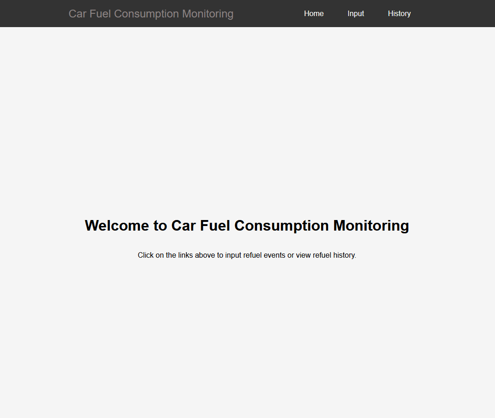

## Exercise 16 : Car consumption monitoring

- [X] Step-1: Plan and create UI where user can give a needed data for a refueling event  

- [X] Step-2: Use React hooks to get refueling data from UI (Step-1) to React Hooks variables  

- [X] Step-3: Store data to Redux store (add a refuel event to store)  

- [X] Step-4: Plan and create UI which displays each refueling events and calculated total/averages  

- [X] Step-5: Load and show all refuel events from Redux store in the UI created in Step-4, calculate and show total/average values  

- [X] Step-6: Add a removing functionality, user can remove a selected refuel event  

- [X] Step-7: Use Routing to show (step-1 or step-4 UI)  

- [X] Step-8: Save data somewhere, so it will be available between app launching times  

- [X] Step-9: Include Recharts library (or some other) and use it to display consumption data  

- [ ] Step-10: Include multi car support  

- [ ] Step-11: Include login/password for your app  

- [ ] Step-12: Publish your application to web server  

---